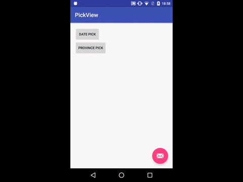

[](https://android-arsenal.com/details/1/2811)

# DEPRECATED

# PickView
This is a helper lib for us to pick date or province like IOS system 
WheelView widget.

Added feature to pick time with WheelView Widget

# Here is date pick effect by gif



## How to use

Add more custom attributes, Just see below  version 1.1.1
    
   ```java
          
         DatePickerPopWin pickerPopWin = new DatePickerPopWin.Builder(MainActivity.this, new DatePickerPopWin.OnDatePickedListener() {
                          @Override
                          public void onDatePickCompleted(int year, int month, int day, String dateDesc) {
                              Toast.makeText(MainActivity.this, dateDesc, Toast.LENGTH_SHORT).show();
                          }
                       }).textConfirm("CONFIRM") //text of confirm button
                              .textCancel("CANCEL") //text of cancel button
                              .btnTextSize(16) // button text size
                              .viewTextSize(25) // pick view text size
                              .colorCancel(Color.parseColor("#999999")) //color of cancel button
                              .colorConfirm(Color.parseColor("#009900"))//color of confirm button
                              .minYear(1990) //min year in loop
                              .maxYear(2550) // max year in loop
                              .showDayMonthYear(true) // shows like dd mm yyyy (default is false) 
                              .dateChose("2013-11-11") // date chose when init popwindow
                              .build();
      
   ```


## About LoopView 
  in version 1.2.0+,can use LoopView like:
 
 ```java
    
        <com.bruce.pickerview.LoopView
            android:id="@+id/loop_view"
            android:layout_width="200dp"
            android:layout_height="180dp"
            android:layout_below="@+id/demo"
            app:canLoop="true"
            app:centerTextColor="#ff000000"
            app:drawItemCount="7" <!-- must be odd number -->
            app:initPosition="3"
            app:lineColor="@color/colorPrimary"
            app:textSize="25sp"
            app:topBottomTextColor="#ffafafaf"/>
            
            
         loopView = (LoopView) findViewById(R.id.loop_view);
                loopView.setInitPosition(2);
                loopView.setCanLoop(false);
                loopView.setLoopListener(new LoopScrollListener() {
                    @Override
                    public void onItemSelect(int item) {
                        
                    }
                });
                loopView.setTextSize(25);//must be called before setDateList
                loopView.setDataList(getList());    
 
 ```
## TimePicker
    
   ```java
          
         TimePickerPopWin timePickerPopWin=new TimePickerPopWin.Builder(MainActivity.this, new       TimePickerPopWin.OnTimePickListener() {
                    @Override
                    public void onTimePickCompleted(int hour, int minute, String AM_PM, String time) {
                        Toast.makeText(MainActivity.this, time, Toast.LENGTH_SHORT).show();
                    }
                }).textConfirm("CONFIRM")
                        .textCancel("CANCEL")
                        .btnTextSize(16)
                        .viewTextSize(25)
                        .colorCancel(Color.parseColor("#999999"))
                        .colorConfirm(Color.parseColor("#009900"))
                        .build();
                timePickerPopWin.showPopWin(MainActivity.this);
      
   ```

# Dependencies

```java 

   compile 'com.brucetoo.pickview:library:1.2.3'
 
```

## TODO

- [ ] add Province pick PopWindow (if i have time)

- [x] add to Jcenter (Wait Jcenter manager verify)

------

# THANKS
 [androidWheelView](https://github.com/weidongjian/androidWheelView) 
 
## License

Copyright 2015 - 2016 Bruce too

Licensed under the Apache License, Version 2.0 (the "License");
you may not use this file except in compliance with the License.
You may obtain a copy of the License at

    http://www.apache.org/licenses/LICENSE-2.0

Unless required by applicable law or agreed to in writing, software
distributed under the License is distributed on an "AS IS" BASIS,
WITHOUT WARRANTIES OR CONDITIONS OF ANY KIND, either express or implied.
See the License for the specific language governing permissions and
limitations under the License.

See [LICENSE](LICENSE) file for details.


